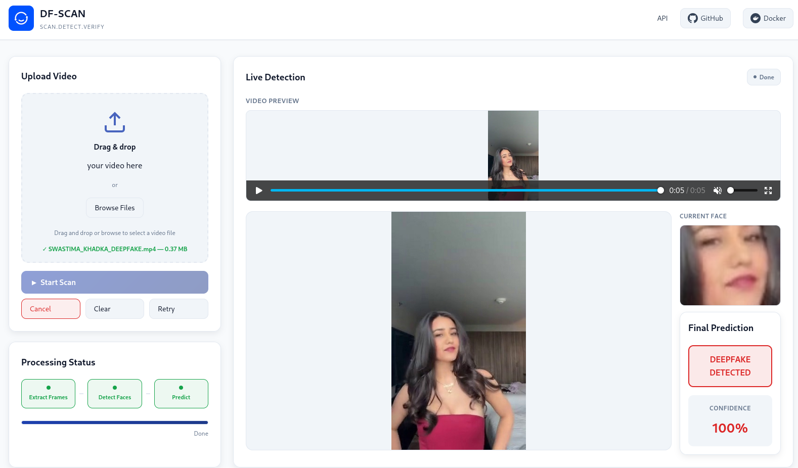

# DF-SCAN  
A deepfake video detection system that determines whether a video is **real** or **fake** using deep learning.  
The system analyzes both spatial (frame-level) and temporal (sequence-level) patterns to identify manipulations and display authenticity results with confidence scores and visual cues.

---

## Experimental Architecture  
Hybrid **CNN + LSTM** architecture that captures:  
- **Spatial inconsistencies** (per-frame CNN features)  
- **Temporal correlations** (LSTM sequence modeling)  

---

## Model Evolution Summary  

| **Model** | **Architecture** | **Video Samples** | **Accuracy** | **ROC-AUC** | **REAL F1** | **FAKE F1** | **Key Observation** |
|------------|------------------|------------------:|--------------:|-------------:|-------------:|-------------:|----------------------|
| **Model 1** | ResNet18 (Frame-based Baseline) | 100 | **0.86** | 0.8415 | 0.52 | 0.92 | Strong on fakes, weak on reals; lacks temporal cues |
| **Model 2** | CNN + LSTM (Temporal Baseline) | 100 | **0.83** | 0.7719 | 0.44 | 0.90 | Temporal modeling added, but underfit due to limited data |
| **Model 3** | CNN + LSTM | 300 | **0.90** | 0.9020 | 0.68 | 0.94 | Temporal learning effective; significant jump in AUC |
| **Model 4** | CNN + LSTM | 500 | **0.94** | **0.9506** | **0.76** | **0.96** | Excellent balance; near production-grade performance |
| **Model 5** | CNN + LSTM | **800** | **0.95** | **0.9746** | **0.82** | **0.97** | Outstanding generalization; strong REAL recovery; approaching deployment quality |
| **Model 6** | CNN + LSTM | **1000** | **0.96** | **0.9830** | **0.87** | **0.98** | Production-grade reliability; nearly perfect fake detection; strong real recall; robust and stable model behavior |

---

## Accuracy by Deepfake Type (Model 6)

| **Deepfake Type** | **Model 6 (LSTM 1000V)** |
|--------------------|--------------------------:|
| **Face2Face**      | 97.14 %                  |
| **NeuralTextures** | 93.28 %                  |
| **Deepfakes**      | 100.00 %                 |
| **FaceSwap**       | 98.52 %                  |
| **DeepFakeDetection** | 100.00 %               |
| **FaceShifter**    | 96.47 %                  |
| **REAL**           | 82.00 %                  |

---

## Observations

### **Scaling Up Helps**  
Each dataset expansion improved overall accuracy and ROC-AUC; the model exhibits continued growth, with performance nearing saturation at 1000 videos.

### **REAL Class Recovery**  
Model 6 achieves **0.87 F1** on REAL samples; the highest among all models so far.

### **High AUC**  
Model 6 demonstrates **0.9830 ROC-AUC**, indicating excellent separation between real and fake samples.

### **Fake Class Robustness**  
Model 6 consistently achieves **94–100%** across all fake types, showing strong generalization without overfitting to a specific fake generation method.

---

## **Deployment Model**
- **CNN + LSTM (Model 6)** for deployment on FaceForensics++.  
- Achieves **0.96 accuracy**, **0.983 ROC-AUC**, and **strong balanced detection**.  
- Production-grade stability with consistent results across multiple fake types.

---

## Deployment

### Docker Deployment

The application is containerized and available on Docker Hub for easy deployment.

#### Quick Start with Docker Compose

1. Download the docker-compose.yml file:
   ```bash
   curl -O https://raw.githubusercontent.com/sudipX0/DF-SCAN/main/docker-compose.yml
   ```

2. Start the application:
   ```bash
   docker compose up -d
   ```

3. Access the application:
   - Web Interface: http://localhost:8000/ui
   - API Documentation: http://localhost:8000/docs
   - Health Check: http://localhost:8000/health

#### Alternative: Docker Run

```bash
docker run -d \
  --name df-scan \
  -p 8000:8000 \
  -v df-scan-temp:/app/backend/temp \
  sudipxo/df-scan:v1.1.0
```

#### Building from Source

```bash
# Clone the repository
git clone https://github.com/sudipX0/DF-SCAN.git
cd DF-SCAN

# Build the Docker image
docker build -t df-scan:dev .

# Run the container
docker run -d --name df-scan -p 8000:8000 df-scan:dev
```

### System Requirements

- **Docker**: Version 20.10 or higher
- **Memory**: Minimum 4GB RAM
- **Storage**: 5GB available disk space
- **CPU**: 2 cores recommended (single core supported)

### Management Commands

```bash
# View application logs
docker compose logs -f

# Stop the application
docker compose down

# Restart the application
docker compose restart

# Update to latest version
docker compose pull
docker compose up -d
```

---

## API Usage

### Health Check

```bash
curl http://localhost:8000/health
```

### Video Analysis

Upload a video file for deepfake detection:

```bash
curl -X POST http://localhost:8000/upload \
  -F "file=@/path/to/video.mp4"
```

### Check Processing Status

```bash
curl http://localhost:8000/status/{session_id}
```

For complete API documentation, visit http://localhost:8000/docs after starting the application.

---

## Project Structure

```
DF-SCAN/
├── backend/
│   ├── app.py                    # FastAPI application entry point
│   ├── model.py                  # ResNet-LSTM model definition
│   ├── models/                   # Pre-trained model weights
│   │   └── production1000_temporal_model.pth
│   ├── utils/                    # Processing utilities
│   │   ├── frame_utils.py        # Video frame extraction
│   │   ├── face_utils.py         # Face detection and cropping
│   │   └── inference.py          # Model inference logic
│   └── temp/                     # Temporary processing files
├── frontend/
│   ├── index.html                # Web interface
│   ├── script.js                 # Client-side logic
│   ├── style.css                 # Styling
│   └── LOGO.png                  # Application logo
├── Dockerfile                    # Container image definition
├── docker-compose.yml            # Container orchestration
└── requirements.txt              # Python dependencies
```

---

## Troubleshooting

### Port Already in Use

If port 8000 is occupied, modify the port mapping in docker-compose.yml:

```yaml
ports:
  - "8080:8000"  # Access application on port 8080
```

### Container Fails to Start

Check the container logs for error details:

```bash
docker compose logs
```

### Health Check Failing

Verify the application is responding:

```bash
curl http://localhost:8000/health
docker exec df-scan curl http://localhost:8000/health
```

---

## License

This project is available under the terms specified in the LICENSE file.

---

## Repository Links

- **Docker Hub**: https://hub.docker.com/r/sudipxo/df-scan
- **GitHub**: https://github.com/sudipX0/DF-SCAN

---
